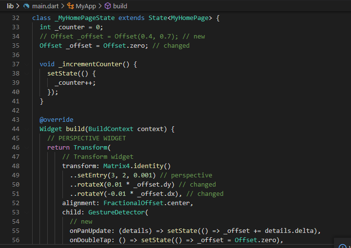
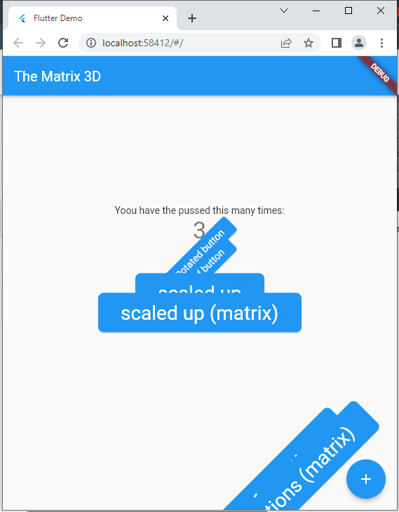

# flutter_transform

## Langkah 1: Buat Project Baru

Buatlah sebuah project flutter baru dengan nama **flutter_transform**. Lalu jadikan repository di GitHub Anda dengan nama **flutter_transform**.

## Langkah 2: Impor dart:math

Tambahkan library dart:math pada file *main.dart*

````
import 'dart:math';
````

## Langkah 3: Tambahkan kode Transform

Tetap di file *main.dart* di class *_MyHomePageState* pada bagian widget *build*, letakkan kode berikut di dalam *children:* setelah teks *$_counter*.



````
Transform.rotate(
    angle: -45 * (pi / 180.0),
    child: ElevatedButton(
      child: const Text("Rotated button"),
      onPressed: () {},
    ),
),
            Transform(
              transform: Matrix4.rotationZ(-45 * (pi / 180.0)),
              alignment: Alignment.center,
              child: ElevatedButton(
                child: const Text("Rotated button"),
                onPressed: () {},
              ),
            ),
            Transform.scale(
              scale: 2.0,
              child: ElevatedButton(
                child: const Text("scaled up"),
                onPressed: () {},
              ),
            ),
            Transform(
              transform: Matrix4.identity()..scale(2.0, 2.0),
              alignment: Alignment.center,
              child: ElevatedButton(
                child: const Text("scaled up (matrix)"),
                onPressed: () {},
              ),
            ),
            Transform.translate(
              offset: const Offset(100, 300),
              child: ElevatedButton(
                child: const Text("translated to bottom"),
                onPressed: () {},
              ),
            ),
            Transform(
              transform: Matrix4.translationValues(100, 300, 0),
              child: ElevatedButton(
                child: const Text("translated to bottom (matrix)"),
                onPressed: () {},
              ),
            ),
            Transform.translate(
              offset: const Offset(70, 200),
              child: Transform.rotate(
                angle: -45 * (pi / 180.0),
                child: Transform.scale(
                  scale: 2.0,
                  child: ElevatedButton(
                    child: const Text("multiple transformations"),
                    onPressed: () {},
                  ),
                ),
              ),
            ),
            Transform(
              alignment: Alignment.center,
              transform: Matrix4.translationValues(70, 200, 0)
                ..rotateZ(-45 * (pi / 180.0))
                ..scale(2.0, 2.0),
              child: ElevatedButton(
                child: const Text("multiple transformations (matrix)"),
                onPressed: () {},
              ),
            )
````


## Tugas Praktikum

1. Selesaikan Praktikum tersebut, lalu dokumentasikan dan push ke repository Anda berupa screenshot hasil pekerjaan beserta penjelasannya di file README.md!
2. Tetap di project yang sama, buatlah folder dan file dart baru lalu praktikkan kode yang ada di tautan ini terkait perspektif di flutter!
3. Tetap di project yang sama, buatlah folder dan file dart baru lalu praktikkan kode yang ada di tautan ini untuk membuat flip animasi 3D!
4. Kumpulkan laporan praktikum Anda berupa link repository GitHub ke LMS!